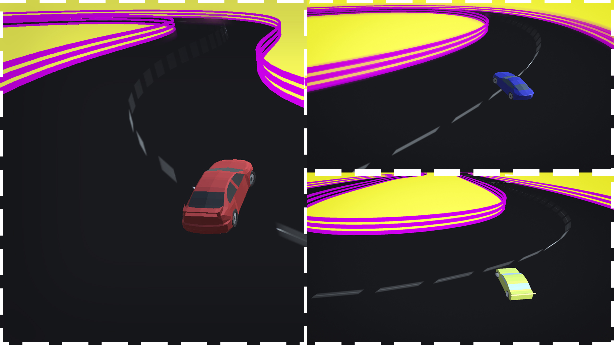
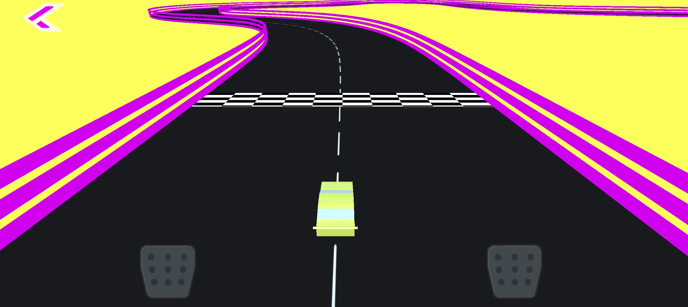

# DriftPro

Drift Pro - уникальная игра про скорость, тачки и дрифт! Заработай на машину своей мечты и отправляйся ставить новые рекорды на уникальных гоночных треках.

## Об игре
Drift Pro - Гипер казуальный дрифт-симулятор. Игроку необходимо проходить сложные, извилистые трассы на время, всего их 20. Каждая последующая трасса сложнее предыдущей, по ходу игры игроку необходимо развивать свой скилл и покупать новые машины за монеты, которые даются после прохождения трассы. Каждый уровень реиграбелен, у игроков есть возможность проходить их заново и ставить новые временные рекорды.

Для покупки доступно 6 видов автомобилей

### Игровой цикл
Игрок проходит трассу, в зависимости от времени прохождения ему начисляются монеты(чем быстрее прошел, тем больше монет), после чего становится доступен следующий уровень - следующая трасса. В какой-то момент игрок не сможет пройти уровень и ему придется купить новый автомобиль за монеты. Все пройденные уровни доступны для повторного прохождения и за них также можно получить монеты.   Чем дороже машина, тем она быстрее и маневренее.
### Управление
#### Управление на мобильных устройствах:
+ Обычный поворот - нажатие на соответствующую половину экрана
+ Поворот с "ручником" - нажатие на соответствующую кнопку педали. Данный поворот намного отзывчивее, чем обычный, но влияет на скорость машины.
#### Управление на ПК:
+ Поворот влево - A/←
+ Поворот вправо - D/→
+ Поворот с "ручником" - зажмите пробел во время поворота

+ Движок: Unity;
+ Платформы: Windows, Android, WebGL;
+ YandexSDK: Импортирован.
На данный момент проект снят с публикации 

